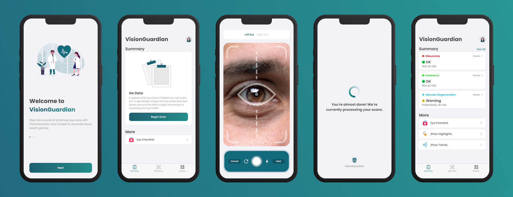

  

# VisionGuardian's Resources

This repository contains all of the resources used for the VisionGuardian project. This includes our app prototype, slide deck, and other notes.

### Figma Prototype

The Figma file used to design and prototype our app can be found in [`src/Figma`](src/Figma). The file is divided up into the following pages:

- **Cover**: ready-to-export frames showcasing product images, backgrounds, and logos.
- **Slides**: additional presentation slide designs.
- **App**: the actual device screens with UI/UX elements.
- **Assets**: assets and components for the entire project.

Other assets utilized can be found in [`src/Figma/Assets`](src/Figma/Assets).

### Canva Exports

All resources relating to our slide deck can be found in [`src/Canva`](src/Canva).

### Notion Exports

Our pitch planning and presentation script files can be found in [`src/Notion`](src/Notion).